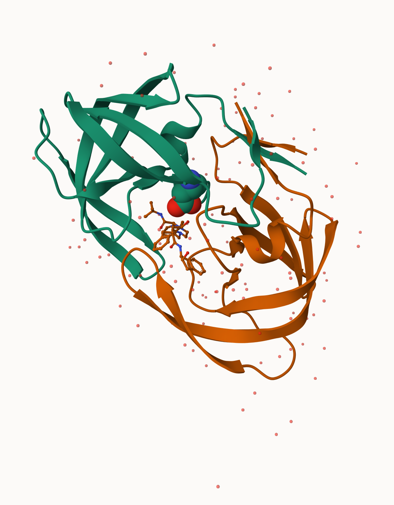
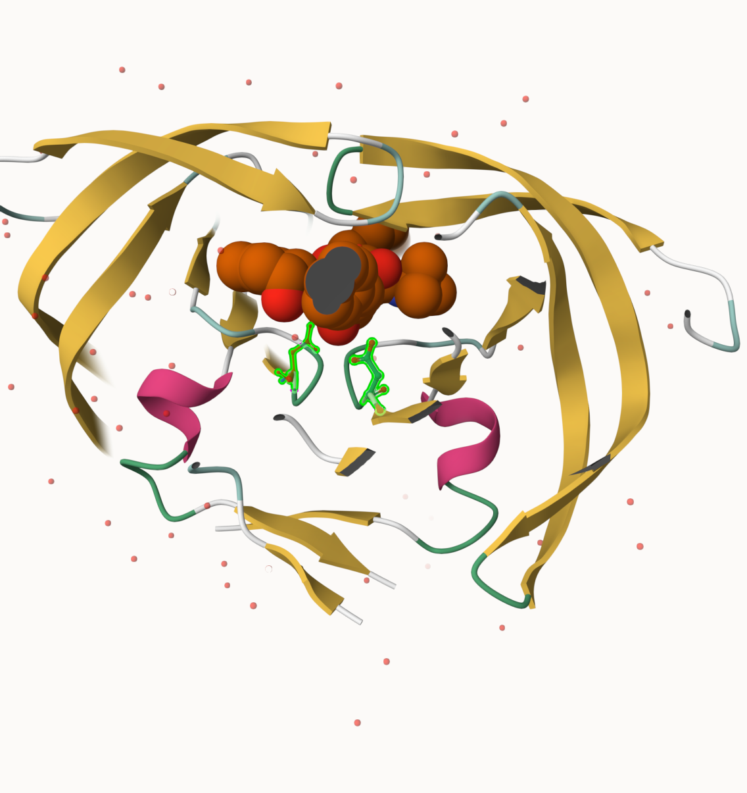

```{r}
pdb_data <- read.csv("pdb_stats.csv", row.names = 1, header = TRUE)
rownames(pdb_data)  # should now show molecule type names
```

Q1: What percentage of structures in the PDB are solved by X-Ray and Electron Microscopy.

> About 93.79%

```{r}
# Q1: X-ray and EM percentages
xray_total  <- sum(pdb_data$X.ray)
em_total    <- sum(pdb_data$EM)
grand_total <- sum(pdb_data$Total)

round((xray_total / grand_total) * 100, 2)                 # X-ray %
round((em_total   / grand_total) * 100, 2)                 # EM %
round(((xray_total + em_total) / grand_total) * 100, 2)    # Combined %
```

Q2: What proportion of structures in the PDB are protein?

> About 97.91%

```{r}
# Q2: Proportion that is protein
protein_total <- sum(pdb_data[c("Protein (only)",
                                 "Protein/Oligosaccharide",
                                 "Protein/NA"), "Total"])
round((protein_total / grand_total) * 100, 2)
```

Q3: Type HIV in the PDB website search box on the home page and determine how many HIV-1 protease structures are in the current PDB?

> There are 1.327 Structures.



Q4: Water molecules normally have 3 atoms. Why do we see just one atom per water molecule in this structure?

> Water molecules normally have 3 atoms (1 oxygen + 2 hydrogens). However, in X-ray crystallography, hydrogen atoms are invisible because they have only 1 electron and produce no detectable electron density at that resolution. So only the oxygen atom of each water molecule appears in the structure.

Q5: There is a critical “conserved” water molecule in the binding site. Can you identify this water molecule? What residue number does this water molecule have

> The critical conserved water molecule is HOH 308. You can find it in Mol\* by toggling waters on and looking in the binding site between the two protein flaps and the drug indinavir. It is conserved because it appears in virtually every HIV-1 protease crystal structure.

Q6: Generate and save a figure clearly showing the two distinct chains of HIV-protease along with the ligand. You might also consider showing the catalytic residues ASP 25 in each chain and the critical water (we recommend “Ball & Stick” for these side-chains). Add this figure to your Quarto document.

This figure shows the two chains of HIV-1 protease (Chain A in blue, Chain B in red) along with the bound ligand indinavir (green).



Q7: \[Optional\] As you have hopefully observed HIV protease is a homodimer (i.e. it is composed of two identical chains). With the aid of the graphic display can you identify secondary structure elements that are likely to only form in the dimer rather than the monomer?

> The most notable secondary structure element that only forms in the dimer is the 4-stranded β-sheet at the dimer interface, formed by the interdigitation of the N and C termini of both chains (residues 1–4 and 96–99). Neither monomer alone can form this sheet — it requires contributions from both chains, making it a true dimer-only structure that is critical for holding the two chains together and maintaining the overall stability of the enzyme.

```{r}
library(bio3d)
pdb <- read.pdb("1hsg")
pdb
```

Q7: How many amino acid residues are there in this pdb object?

> 198 amino acid residues

Q8: Name one of the two non-protein residues?

> HOH (water) or MK1 (indinavir)

Q9: How many protein chains are in this structure?

> 2 chains (A and B)

```{r}
attributes(pdb)
```

```{r}
head(pdb$atom)
```

```{r}
library(bio3dview)
library(NGLVieweR)

view.pdb(pdb) |>
  setSpin()
```

```{r}
# Select the important ASP 25 residue
sele <- atom.select(pdb, resno=25)

# and highlight them in spacefill representation
view.pdb(pdb, cols=c("navy","teal"), 
         highlight = sele,
         highlight.style = "spacefill") |>
  setRock()
```

```{r}
adk <- read.pdb("6s36")
```

```{r}
adk
```

```{r}
# Perform flexiblity prediction
m <- nma(adk)
```

```{r}
plot(m)
```

```{r}
mktrj(m, file="adk_m7.pdb")

```

```{r}
view.nma(m, pdb=adk)
```

Q10. Which of the packages above is found only on BioConductor and not CRAN?

> msa, it's installed via BiocManager::install() meaning it's only on BioConductor, not CRAN.

Q11. Which of the above packages is not found on BioConductor or CRAN?:

> bio3dview, it's installed via remotes::install_github() meaning it's only on GitHub, not on BioConductor or CRAN.

Q12. True or False? Functions from the pak package can be used to install packages from GitHub and BitBucket?

> TRUE, the package can be used to install packages from GitHub

```{r}
library(bio3d)
aa <- get.seq("1ake_A")
```

```{r}
aa
```

Q13. How many amino acids are in this sequence, i.e. how long is this sequence?

> There are 214 amino acids

```{r}
# Blast or hmmer search 
b <- blast.pdb(aa)
```

```{r}
# Plot a summary of search results
hits <- plot(b)
```

```{r}
# List out some 'top hits'
head(hits$pdb.id)
```

```{r}
its <- NULL
hits$pdb.id <- c('1AKE_A','6S36_A','6RZE_A','3HPR_A','1E4V_A','5EJE_A','1E4Y_A','3X2S_A','6HAP_A','6HAM_A','4K46_A','3GMT_A','4PZL_A')
```

```{r}
# Download releated PDB files
files <- get.pdb(hits$pdb.id, path="pdbs", split=TRUE, gzip=TRUE)
```

```{r}
# Align releated PDBs
pdbs <- pdbaln(files, fit = TRUE, exefile="msa")
```

```{r}
library(bio3dview)

view.pdbs(pdbs)
```

```{r}
# Vector containing PDB database codes
ids <- basename.pdb(pdbs$id)

anno <- pdb.annotate(ids)
unique(anno$source)
```

```{r}
anno
```

```{r}
# Perform PCA
pc.xray <- pca(pdbs)
plot(pc.xray)
```

```{r}
# Calculate RMSD
rd <- rmsd(pdbs)

# Structure-based clustering
hc.rd <- hclust(dist(rd))
grps.rd <- cutree(hc.rd, k=3)

plot(pc.xray, 1:2, col="grey50", bg=grps.rd, pch=21, cex=1)
```

```{r}
# Visualize first principal component
pc1 <- mktrj(pc.xray, pc=1, file="pc_1.pdb")
```

```{r}
#Plotting results with ggplot2
library(ggplot2)
library(ggrepel)

df <- data.frame(PC1=pc.xray$z[,1], 
                 PC2=pc.xray$z[,2], 
                 col=as.factor(grps.rd),
                 ids=ids)

p <- ggplot(df) + 
  aes(PC1, PC2, col=col, label=ids) +
  geom_point(size=2) +
  geom_text_repel(max.overlaps = 20) +
  theme(legend.position = "none")
p
```

```{r}
# NMA of all structures
modes <- nma(pdbs)
```

```{r}
plot(modes, pdbs, col=grps.rd)

```

Q14. What do you note about this plot? Are the black and colored lines similar or different? Where do you think they differ most and why?

> The black and colored lines are clearly different. The black lines show low and flat fluctuations indicating rigid, stable conformations, while the pink and green lines show much higher fluctuations, especially around residues 50 and 125–150. These regions differ most because Adk undergoes large conformational changes between open and closed states during its catalytic cycle, and the colored structures likely represent more open/flexible conformations while the black ones represent more closed/rigid conformations with ligand bound.
